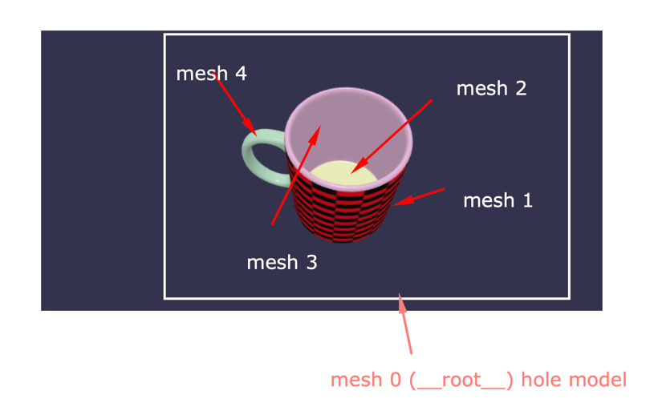

# Demo 3D models

[Demo Link](https://xeilen.github.io/)

---

### Description

It's a demo project where we can select models, change the size, and wrap them by image.

---

### Build tool

- [Vite 2.7.2](https://vitejs.dev/)

---

### Framework

- [Vue 3.2.25](https://v3.vuejs.org/)

---

### Dependencies

- [Babylon JS 4.2.1](https://www.babylonjs.com/)
- [Babylon JS Loaders 4.2.1](https://www.npmjs.com/package/@babylonjs/loaders)
- [Bootstrap 5.1.3](https://getbootstrap.com/)

---

### Installation

- Clone this repository 
  ```
  git clone https://github.com/xeilen/xeilen.github.io.git
  ```
- Install dependencies
  ```
  npm install
  ```
- Run on localhost
  ```
  npm run dev
  ```

---

### Steps to render model

- At first, we need to create `<canvas>` element using JavaScript, 
  because every time when we change size or image for our model we should delete
  already existing `<canvas>` and create it again to avoid WebGL errors and warnings.
    ```
    document.creaateElement('canvas')
    ```
  
- Import already installed BABYLON
    ```
    import * as BABYLON from 'babylonjs';
    ```
  or just only what we need:
    ```
    import { Engine, Scene, ArcRotateCamera, ect } from 'babylonjs'
    ```

- Next, we should create an instance of `engine` and pass as argument our `<canvas>` element
    ```
    const engine = new BABYLON.Engine(canvas);
    ```

- Create `scene` passing as argument  our `engine` instance
    ```
    const scene = new BABYLON.Scene(engine);
    ```

- Add `camera` to the `scene` and attach the camera to the `<canvas>`. In our case, we use `ArcRotateCamera`
    ```
    const camera = new BABYLON.ArcRotateCamera("camera", -0.2, 1.5, 10, new BABYLON.Vector3(0, 0, 0), scene);
    camera.attachControl(canvas, true);
    ```
  
- Add the light to illuminate the top of the model pass a positive number as the second argument to `Vector3`
    ```
    new BABYLON.HemisphericLight("light", new BABYLON.Vector3(0, 1, 0), scene)
    ```
  also, we can add second light to illuminate the bottom of the model pass a negative number
  as the second argument to `Vector3` 
    ```
    new BABYLON.HemisphericLight("light", new BABYLON.Vector3(0, -1, 0), scene)
    ```
  Read more about `Vector3` [here](https://doc.babylonjs.com/typedoc/classes/babylon.vector3)
  
- Now, we need to create `material` and add it to the scene passing `scene` as the second argument. 
  Babylon JS has a few types of materials. We will use `PBRMaterial`
    ```
    const material = new BABYLON.PBRMaterial('materialName', scene);
    ```

- Create `texture` and add it to `material`
    ```
    const texture = new BABYLON.Texture('image.jpg', scene);
    material.albedoTexture = texture;
    ```
- **Load model.** Before loading 3d model we need to import loader helper.
    ```
    import 'babylonjs-loaders'
    ```
    For loading model we will use `BABYLON.SceneLoader.LoadAssetContainer(rootPass, fileName, scene, onSuccessCallback)`  
    Possible file types are `.gLTF`, `.obj`, `.stl`.
    Recommended to use `.gltf` format.  
    In`onSuccessCallback` we can get access to our `model`
    ```
    const onSuccessCallback = (model) => {
      // ...
    }
    ```
    That mean we can scale, change material for each mesh, change position ect.
    
    Every model has array of meshes. If we load model in `.gltf` format,
    our model will have `__root__` mesh with [0] index.
    ```
    const rootMesh = model.meshes[0];
    ```
    
    For example, if we have access to `__root__` mesh we can scale it proportionally,
    and then we don't need to scale each mesh.
    
    For each mesh(except `__root__`) we can apply different textures.  
    Example of usage:  
    ```
      BABYLON.SceneLoader.LoadAssetContainer(rootPath, 'fileName.gltf', scene, (model) => {
        const meshes = model.meshes;
        meshes[0].scaling = new BABYLON.Vector3(25, 25, 25)
        meshes[0].position.y = -2;
  
        meshes[1].material = material;
        meshes[2].material = material2;
  
  
        model.addAllToScene();
      })
    ```
    
    Use `model.addAllToScene()` in the end to add model to the `scene`

- Finally, run render loop for drawing and for update every change
  ```
  engine.runRenderLoop(() => {
    scene.render();
  })
  ```
